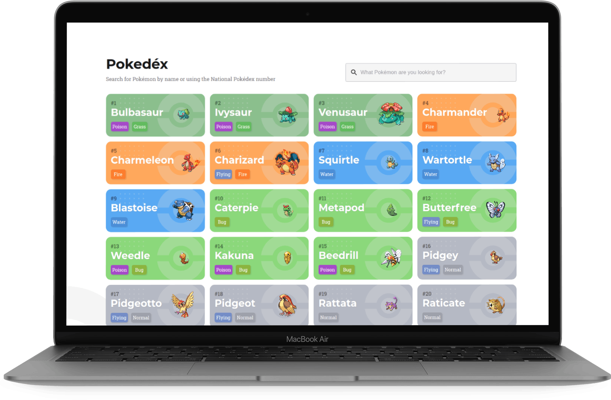

<br/>
<h4 align="center">
<br>
</h4>

 <h1 align="center"> Pokédex </h1>


<br>

## :rocket: Tecnologias utilizadas
Esse projeto foi desenvolvido com as seguintes tecnologias:
- [React] - O React é uma biblioteca que permite o desenvolvimento de aplicações usando Javascript e React;
- [Redux] - O Redux é um contêiner de estado previsível para aplicativos JavaScript. Ele ajuda você a escrever aplicativos que se comportam consistentemente, executados em diferentes ambientes (cliente, servidor e nativo) e são fáceis de testar;
-- [Redux Saga] - O redux-saga é uma biblioteca que tem como objetivo tornar os efeitos colaterais dos aplicativos mais fáceis de gerenciar, mais eficientes de executar, fáceis de testar e melhores em lidar com falhas;
- [Formik] - O formik é uma biblioteca de gerenciamento de formulário controlados de forma eficiente.
- [Axios] - O Axios é um cliente HTTP baseado em Promises para Browser e NodeJS;
- [Typescript] - TypeScript é um superset para adicionar tipagem no JavaScript que visa melhorar o processo de desenvolvimento, melhorando o intelliSense da IDE e prevenindo bugs.
- [Styled Components] - O Styled Components é uma biblioteca que permite criar escopos de estilização para os componentes;
- [Storybook] -  Ferramenta para pré-visualização isolada dos componentes, muito útil no processo de desenvolvimento pois não precisamos acessar o local que o componente é renderizado ou até mesmo startar a aplicação.
- [Immer] - Bilioteca para criação de estados imutáveis com foco em performance.

<hr/>

## Instalar dependências

Para instalar as dependencias do projeto,  executar o comando

```
npm install  ou yarn install
```


## Executar Projeto

Para rodar o projeto em ambiente de desenvolvimento, executar o comando

```
npm start  ou yarn start
```

## Executar Storybook

Para rodar o storybook em ambiente de desenvolvimento, executar o comando

```
npm storybook  ou yarn storybook
```

## Executar Teste

Para rodar os teste em ambiente de desenvolvimento, executar o comando

```
npm test  ou yarn test
```


## Demo Online

https://relaxed-jang-821b42.netlify.app/
